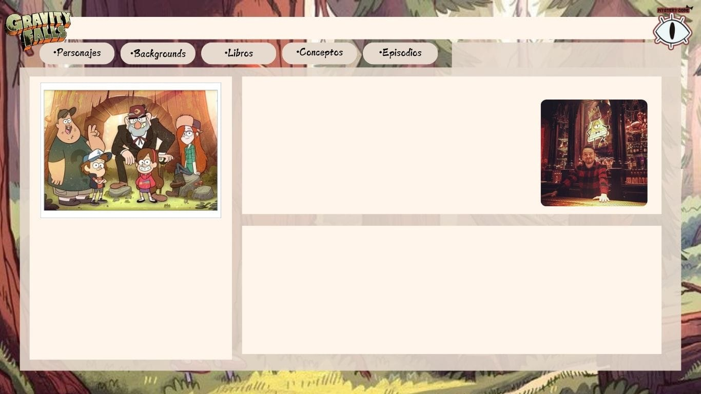
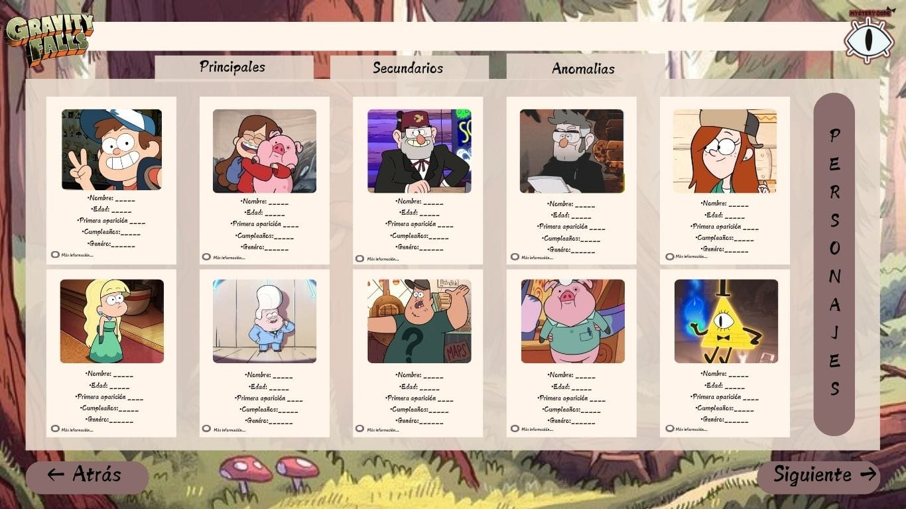
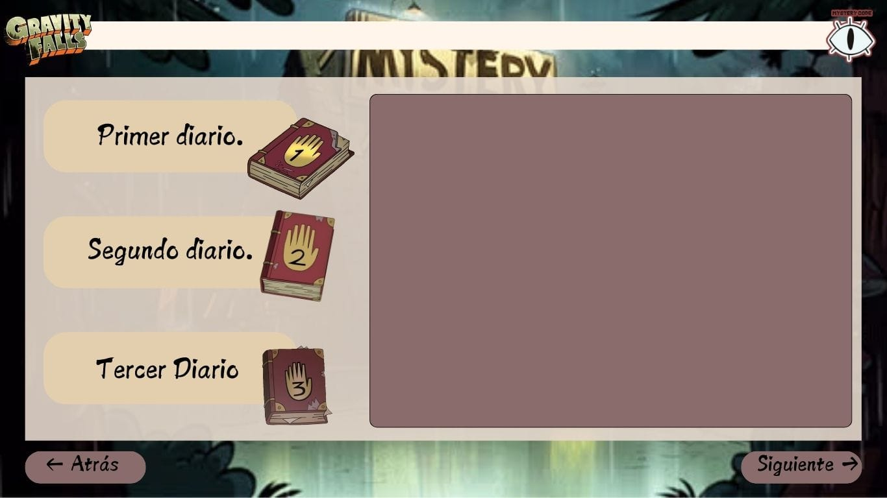

# Web Mystery Code

Buenos días, tardes o noches, querido(a) espectador(a).

¿Qué es lo que lo trae a este lugar? ¿Estás seguro de que tu pequeña mente incomprendida será capaz de entender cada misterio? Si es así, estás listo para adentrarte a este mundo de fantasía.

## ¿Cómo surgió la idea de esta pequeña página llena de misterios?

La idea surgió de forma aleatoria y fue aceptada por el grupo de desarrollo. Para organizar nuestras ideas y visualizar el proyecto, realizamos bocetos en formato JPG, los cuales sirvieron de guía para el resultado final.

### Bocetos base

Aquí puedes ver los bocetos iniciales que utilizamos para guiar el desarrollo del proyecto:

- **Boceto 1**: 

  En esta imagen, se puede observar la página de inicio del proyecto. La idea principal es que esta página sirva como punto de entrada a las diferentes secciones del sitio. La estructura está basada en:

  - **Personajes**: Donde los usuarios pueden conocer a los personajes principales y secundarios de la serie.
  - **Capítulos**: Una sección dedicada a los capítulos, permitiendo a los usuarios acceder a las historias en orden.
  - **Backgrounds**: Imágenes y fondos que enriquecen la ambientación del proyecto.

  Además, la página de inicio también presenta una biografía del creador y la historia detrás de la creación de la serie, proporcionando un contexto adicional para los visitantes.

- **Boceto 2**: 
- **Boceto 3**: 

